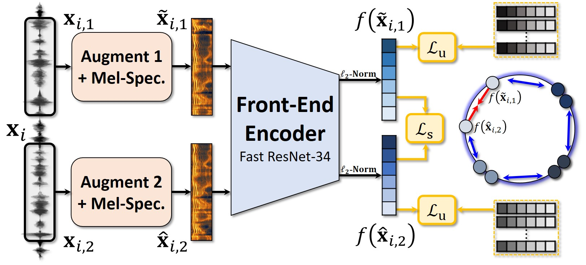

# Contrastive equilibrium learning



## Unsupervised learning framwork
This repository provides a implementation of the Contrastive Equilibrium Learning (CEL) for unsupervised learning of [this paper](https://arxiv.org/abs/2010.11433).
The code is developed on the [baseline framework](https://github.com/joonson/voxceleb_unsupervised) for the VoxSRC 2020 Challenge.


### Requirements
The dependencies for this code are the same as [baseline framework](https://github.com/joonson/voxceleb_unsupervised).
```bash
pip install -r requirements.txt
```


### Dataset for training and augmentation
The [VoxCeleb](http://www.robots.ox.ac.uk/~vgg/data/voxceleb/) datasets are used for these experiments.
The train list should contain only the file path, one line per utterance, as follows:
```bash
id00012/21Uxsk56VDQ/00001.wav
id00012/21Uxsk56VDQ/00002.wav
...
id09272/u7VNkYraCw0/00026.wav
id09272/u7VNkYraCw0/00027.wav
```
The train list for VoxCeleb2 can be download from [here](https://drive.google.com/file/d/1K9qpPNqhH4Ib3rqz6sFBUbrDLXGc8Tg7/view?usp=sharing) and the test list for VoxCeleb1 from [here](https://drive.google.com/file/d/1Lfb0bJAbE2zSCXfhLhJUQxDgro_mHRiq/view?usp=sharing).
The list for training also can be created by runing `python makelist_post.py` in a directory `./list`.

Furthermore, you can download the [MUSAN](https://www.openslr.org/17/) noise corpus.
After downloading and extracting the files, you can split the audio files into short segments for faster random access as the following command:
```bash
python process_musan.py /home/shmun/DB/MUSAN/
```
where `/home/shmun/DB/MUSAN/` is our path to the MUSAN corpus.

You can also follow the instructions on the following pages for download and the data preparation of training and augmentation.
+ [Training](https://github.com/clovaai/voxceleb_trainer): VoxCeleb1&2 datasets
+ [Augmentation](https://github.com/joonson/voxceleb_unsupervised): MUSAN corpus and RIR filters


### Objective functions
```bash
Uniformity (uniform)
Prototypical (proto)
Angular Prototypical (angleproto)
Angular Contrastive (anglecontrast)
```


### Front-end encoders
```bash
FastResNet34 (ResNetSE34L)
VGGVox
TDNN
```


### Training and evaluation using CEL
Training example with the development set of VoxCeleb2 in an unsupervised manner.
```bash
python trainSpeakerNet.py --max_frames 180 --batch_size 200 --unif_loss uniform --sim_loss anglecontrast --augment_anchor --augment_type 3 --save_path save/a-cont --train_list list/train_vox2.txt --test_list list/test_vox1.txt --train_path /home/shmun/DB/VoxCeleb/VoxCeleb2/dev/wav/ --test_path /home/shmun/DB/VoxCeleb/VoxCeleb1/test/wav/ --musan_path /home/shmun/DB/MUSAN/musan_split/
```
where `/home/shmun/DB/VoxCeleb/VoxCeleb2/dev/wav/`, `/home/shmun/DB/VoxCeleb/VoxCeleb1/test/wav/`, `/home/shmun/DB/MUSAN/musan_split/` are our paths to VoxCeleb2 development set, VoxCeleb1 test set, processed MUSAN corpus, respectively. And `save/a-cont` is a directory to save results.

Evaluation example with the original test set of VoxCeleb1.
```bash
python trainSpeakerNet.py --eval --initial_model save/a-cont/model/model000000001.model --test_list list/test_vox1.txt --test_path /home/shmun/DB/VoxCeleb/VoxCeleb1/test/wav/
```
Code for VOiCES evaluation is [here](https://github.com/msh9184/contrastive-equilibrium-learning/tree/master/eval_VOiCES).


### Pre-trained models
We share the pre-trained models reported in [this paper](https://arxiv.org/abs/2010.11433). Move the downloaded pre-trained models to the directory `./save`.

+ `Unif + A-Prot` `EER: 8.01%`: [Download](https://drive.google.com/file/d/1j1gFZ52a10UT6EpT_HqahbEbq2zp97cT/view?usp=sharing)
```bash
python trainSpeakerNet.py --eval --initial_model save/pre-trained_unspv_unif-a-prot.model --test_list list/test_vox1.txt --test_path /home/shmun/DB/VoxCeleb/VoxCeleb1/test/wav/
```

+ `Unif + A-Cont` `EER: 8.05%`: [Download](https://drive.google.com/file/d/1RZdAU6efbRSmUsIwqW0Q_mpEwdAbm7xY/view?usp=sharing)
```bash
python trainSpeakerNet.py --eval --initial_model save/pre-trained_unspv_unif-a-cont.model --test_list list/test_vox1.txt --test_path /home/shmun/DB/VoxCeleb/VoxCeleb1/test/wav/
```
